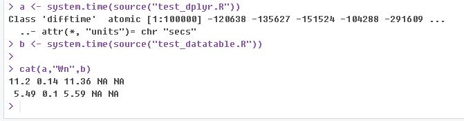

# TalkingData AdTracking Fraud Detection Challenge - Part1  

---


Part1은 첫 시작부터 4월말까지의 경험으로 작성해 본다.   
중간 정리한 [발표 자료](https://github.com/LegenDad/KaggleUXLog/blob/master/AdT/Note/UX%20About%20AdTracking.pdf)와 크게 다른 내용은 없다.  

### Intro  
왜 Fraud Click을 찾아야 하는가?   

[](https://i.kinja-img.com/gawker-media/image/upload/imuqp7dbsu41o3socgwi.mp4)  
Chinese Farm  

Fraud라는 용어 자체의 불편한 경험이 있지만,  
위 이미지 및 영상으로 대충 파악하고 해당 데이터 분석을 시작한다.  


### 파생 변수 생성에 대한 접근  

익숙치 않은 시각화을 통한 인사이트 도출 보다는 모델링을 해서 나온 결과를 통해  
변수별 중요도 파악을 해서 파생 변수 추가 삭제를 진행 하는 방법으로 진행했다.  
 


### 여러 알고리즘 별 결과 비교  

|  <center>Model</center> |  <center>Size</center> |  <center>Valid AUC</center> | <center>LB Score </center> |
|:--------|:--------:|--------:|-------:|
|**GLM** | *1천만* |*0.92* | *0.89*|
|**GLM** | *2천만* |*0.92* | *0.89*|
|**Decision Tree** | *1천만* |*0.92* | *0.65*|
|**Random Forest** | *1천만* |*memory limit* | *memory limit*|
|**XGB** | *1천만* |*0.97* | *0.91*|
|**XGB** | *2천만* |*0.97* | *0.90*|
|**XGB** | *5천만* |*0.97* | *0.94*|
|**LGBM** | *1천만* |*0.92* | *0.89*|
|**LGBM** | *2천만* |*0.92* | *0.93*|
|**LGBM with  Categorical Features** | *1천만* |*0.92* | *0.96*|  

---

* GLM : [Code](https://github.com/LegenDad/KaggleUXLog/blob/master/AdT/Code/Glm_Tree_Sample.R)  

XGB, LGBM의 결과가 너무 우수해서 개선의 필요성을 느끼지 못했다
사용해보고 교차 분석 활용 경험 용도였다.  

```r
library(caret)
model <- train(factor(is_attributed)~., adtr, method = "glm",
               trControl = trainControl(method = "cv", number = 10, verboseIter = TRUE))
```

* Decision Tree : [Code](https://github.com/LegenDad/KaggleUXLog/blob/master/AdT/Code/Glm_Tree_Sample.R)  
훈련은 잘되는 듯 했으나, 최종 스코어 점수가 많이 떨어진 경우  
과적합 해결을 위해 파라미터 수정이 필요했으나,   
마찬가지로 XGB, LGBM 결과와 너무 비교되서 배제했다.  

* RandomForest : [Code](https://github.com/LegenDad/KaggleUXLog/blob/master/AdT/Code/RandomForest_server.R)  
train sample  훈련에서도 메모리 부족을 경험하게 한 모델  
  

* XGB : [Code](https://github.com/LegenDad/KaggleUXLog/blob/master/AdT/Code/XGBoost_sample.R)  
상위권 LB 욕심을 자극주는 모델이었다.  
위 모델들 보다 적은 메모리, 빠른 실행 시간을 보장해주는 알고리즘  
개인적으로 모델 활용을 위한 훈련, 검증, 테스트 셋에 대한 활용에 많은 도움을 준 모델  

* LGBM : [Code](https://github.com/LegenDad/KaggleUXLog/blob/master/AdT/Code/LightGBM_sample.R)  
최종 적용 모델  
Categorical Features 활용으로 XGB 대비 Score 향상이 확실히 된 모델  
XGB 대비 훈련 속도도 빠르다.  
자세한 개선 방향은 Part2에서 적을 예정이다.

### 모델 생성을 위한 훈련, 검증, 테스트 데이터 구상표   
  

Train과 Test 구별을 위한 key 값 : tri vs -tri  
Train과 Valid 구별을 위한 key 값 : train vs valid  
위 2개의 key면  train+test Set에서  
train, valid, test 그리고
target for train, target fot valid   
모두 접근 할 수 있다.   
또한 이렇게 습득한 key값에 대한 경험은  
datatable 패키지에 활용하는 면에서도 많은 도움이 되었다.  


### R Package : dplyr vs datatable  
두 패키지 모두 정말 훌륭하다.  
하지만 이번 데이터 활용에서 느낀 경험은 두 패키지는 활용 용도가 다르다.
* dplyr
가독성이 좋다. 코드를 보면 바로 이해할 수 있는 느낌을 준다.  
하지만 데이터가 커지면 연산 속도가 현저하게 느려진다.  
* datatable  
dplyr에 비하면 가독성이 떨어진다.  
익숙치 않은 상태에서 보면 외계어가 보이는 느낌이 있다.  
하지만 dplyr로 비슷하게 구현하고 보면 적응이 금방 된다.  

두 패키지 모두 경험 후, 실제 연산 속도를 비교해 봤다.  
같은 결과값을 주는 단일 코드 값 비교  
  
여러 파생 변수 생성에 있어서 비교  
  
속도는 2배 이상 차이가 나는 듯 하다.  
사용한 코드는 [dplyr](/KaggleUXLog//AdT/Code/test_dplyr.R), [datatable](/KaggleUXLog//AdT/Code/test_datatable.R)
