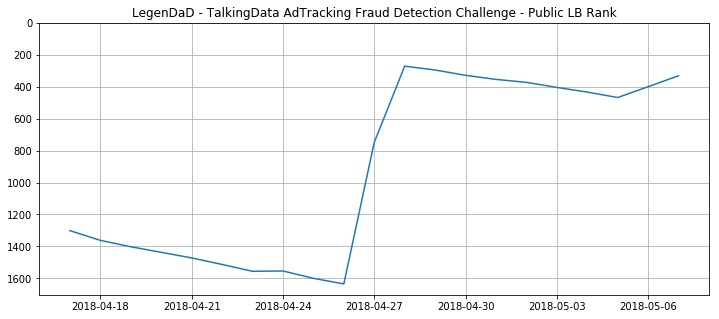

# TalkingData AdTracking Fraud Detection Challenge - Part2  

---

  

---  

Part1은 LB Score 0.96대 진입까지의 경험이었고,  
Part2는 0.97~0.979 점수로 모델 성능 개선 및 대회 마무리까지의 경험기이다.  

---
### 성능 개선 실패의 경험  


* Downtime 변수 추가  
atrributed_time과 click_time 의 차이로 Downtime이라는 변수를 만들어서  
활용한 결과, 샘플 데이터에서는 높은 AUC를 보여주었지만,  
test에 적응해서 예측하기에는 해당 변수 값을 예측하는 모델이 필요했고,  
이렇게 만든 모델의 성능이 좋지 못해서 최종 AUC 개선에는 실패한 경우  
<br>

* 무작위적으로 변수를 만들기  : [Code](https://github.com/LegenDad/KaggleUXLog/blob/master/AdT/Code/Fail/stupid_sample.R)  
150개가 넘는 파생변수를 만들어서 적용해 보았지만,  
AUC 향상은 전혀 이루어지지 않은 경우  
위 Code 링크를 보면 만든 변수 확인이 가능하다.  
Part3에서 언급하겠지만, 900개가 넘는 변수를 만든 상위권 유저도 있었다.   

---
### 0.97대 진입을 만들어 준 파생변수 : NextClick  

|  <center>Model</center> |  <center>Size</center> |  <center>Valid AUC</center> | <center>LB Score </center> |
|:--------|:--------:|--------:|-------:|
|**LGBM with  Categorical Features** | *1천만* |*0.92* | *0.96*|
|**LGBM with  NextClick** | *1천만* |*0.97* | *0.9715*|
|**LGBM with  NextClick** | *5천만* |*0.97* | *0.9765*|
|**LGBM with  NextClick** | *ALL* |*0.97* | *0.9735*|  

---
이렇게 성능 향상을 유도한 변수지만, 만들기가 쉽지 않았다.  
python을 활용한 경우는 커널에 정보가 있었지만, R은 없어서 직접 만들어 보았는데...  
train_sample 데이터로 해당 변수 생성하고 모델링까지의 과정이  
기존 코드로 3분이면 끝나는 과정이 30분이 걸렸다.  
그래도 일단 해본다는 마음으로 train 데이터에 적용했지만,  
오랜 시간을 기다려도 변수 생성이 되지 않았다.  
이틀을 더 시도했지만, 결과는 마찬가지...  

포기할 수 는 없어서,  
Kaggle Discusion에 [질문](https://www.kaggle.com/c/talkingdata-adtracking-fraud-detection/discussion/56065)을 남겨보았다.  
```r  
 tdiff <- function(tdiff) {
  vc <- NULL
  for (x in 1:length(tdiff)) {
    interval <- interval(tdiff[x], tdiff[x+1])
    diffsecond <- as.integer(seconds(interval))
    vc <- append(vc, diffsecond)
  }
  vc <- ifelse(is.na(vc), 0, vc)
  vc <- append(vc, 0)
  return(vc)
}
```  
위 코드 보여주고, 도움을 기다렸다.  

그 결과 1시간 이내로 문제점을 해결할 수 있는, 댓글들이 달렸다.  
답을 주신 분들이 고마워서 약간 소개글을 남겨본다.  

* [CPMP](https://www.kaggle.com/cpmpml)  
무려 5분 만에 답글을 적어주신 분...  
python panda 활용할 때도 오래 걸리는 연산이라며, 힘을 주신 분  
그러나, 이 분은 나에게는 투머치토커(영어로 안 쓴다. 혹여나 보면 미안...)  
이 대회 최종 6등 하신 능력자   
Part3에 또 쓰겠지만 상위권 유저들의 글 모음도 엮어 올리시는 활동을 하신 분  

* [Vicens Gaitan](https://www.kaggle.com/vicensgaitan)  
30분 이내로 R로 해결 할 수 있는 직접적인 해결책을 주신 분  
방법은 datatable 패키지의 shift 함수 였다.
for문을 이용한 연산보다는 패키지 함수를 이용하는 것이 메모리나 연산 상 우위에 있는 듯 하다.  

* [Laurae](https://www.kaggle.com/laurae2)  
1시간 뒤 나타난 최강의 능력자  
shift 함수의 연산 능력을 지적해주고, 개선방안을 직접 적어주시는 친절함까지 보유하신 분  
뒤늦게 알게 되었지만, R 벤치마크 패키지를 직접 만들어서 배포하시는 능력자에  
xgboost, lightgbm 파라미터에 대한 벤치마크 정보를 배포하시는 능력자였다.  

이렇게 NextClick  변수 활용에 성공했고,  
만드는 법을 익혔으니 PrevClick 까지 활용을 하게 되었다.  


|  <center>Model</center> |  <center>Size</center> |  <center>Valid AUC</center> | <center>LB Score </center> |
|:--------|:--------:|--------:|-------:|
|**LGBM with  NextClick** | *1천만* |*0.97* | *0.9715*|
|**LGBM with  NextClick** | *5천만* |*0.98* | *0.9765*|
|**LGBM with  NextClick** | *ALL* |*0.98* | *0.9735*|
|**LGBM with  Next_Prev_Click** | *1천만* |*0.97* | *0.9709*|
|**LGBM with  Next_Prev_Click** | *5천만* |*0.98* | *0.9768*|
|**LGBM with  Next_Prev_Click** | *ALL* |*0.98* | *0.9735*|

아주 약간의 상승을 보여줬다.  

---
### 0.9768에서 0.98로 턱걸이 : All Data의 과적합 해결하기  
<br>
위 테이블 보면 알겠지만, 5천만을 샘플로 훈련했을 때 결과가 제일 좋았고,  

오히려 전체 훈련데이터를 사용하면 overfitting으로 score가 하락했다.  


해결법은 정말 간단했다.  
기존에는 train, test 별도로 파생변수 생성을 진행했지만,  
생각해보면 이렇게 만들면 test에서 만들어지는 파생변수들이  
train 변수들과의 흐름이 끊어지고 새로 만들어지게 된다.   
파생변수 만드는 과정 이전에 train, test를 하나로 병합해서 진행하면,  
변수들의 흐름이 유지되고, 코드를 줄일 수 있게 된다.  

[Code Here](../Code/LightGBM_NextPrev_Click_server.R)

|  <center>Model</center> |  <center>Size</center> |  <center>Valid AUC</center> | <center>LB Score </center> |
|:--------|:--------:|--------:|-------:|
|**LGBM with  NextClick** | *5천만* |*0.98* | *0.9765*|
|**LGBM with  NextClick** | *ALL* |*0.98* | *0.9735*|
|**LGBM with  Next_Prev_Click** | *5천만* |*0.98* | *0.9768*|
|**LGBM with  Next_Prev_Click** | *ALL* |*0.98* | *0.9735*|
|**LGBM with  TR_Te_ALL** | *5천만* |*0.98* | *0.9777*|
|**LGBM with  TR_Te_ALL** | *ALL* |*0.98* | *0.9789*|

---
### 대회 마무리  
이렇게 만든 점수를 최종으로 0.98 턱걸이를 하였으나,  
마감 3시간 전, 갑자기 300등~350등 정도 등수 하락이 발생  
노력의 결과가 급하락하였고, 원치 않은 상황이지만 등수 복귀를 시도...  
결과는 Bronze Medal 확보로 마무리되었다.  
