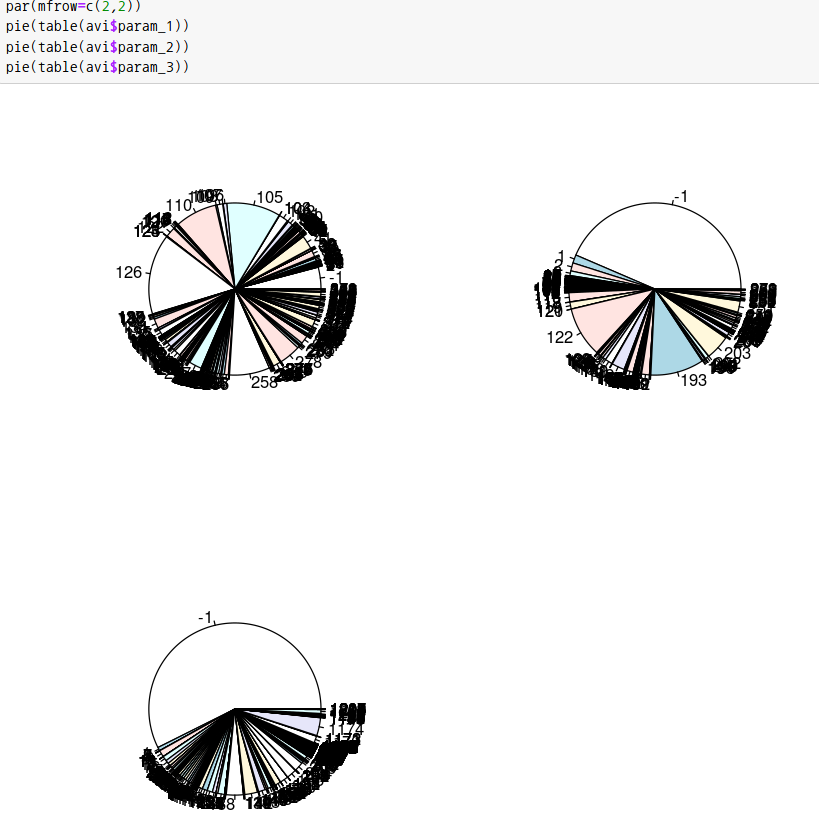

Avito Demand Prediction Challenge
===


<!-- @import "[TOC]" {cmd="toc" depthFrom=1 depthTo=6 orderedList=false} -->
<!-- code_chunk_output -->

* [My Intro About Avito](#my-intro-about-avito)
* [Feature](#feature)
	* [Categorical](#categorical)
	* [Numerical](#numerical)
	* [Text](#text)
	* [Image](#image)

<!-- /code_chunk_output -->

## My Intro About Avito

Avito Demand Prediction Challenge에 대한 접근 포인트는 순위나 점수 향상을 위한 접근이 아닌 생소한 부분에 대한 학습의 목적이 강해서, 결과 보다는 과정 상에서 얻은 학습의 결과를 추후 다른 데이터 활용의 용이함을 위하여 적어본다.  


## Feature

Avito Demand Prediction Challenge의 Data에는 숫자형 특성, 분류형 특성, 텍스트 특성, 이미지 특성이 모두 들어가 있다. deal_probability을 예측하기 위해 이런 특성들을 활용하는 모델을 생성하기 위해서는 각각의 특성 별로 처리해야 하는 과정이 달랐고, 수행 과정에서의 경험을 남겨본다.


### Categorical

region, city, category, param 등 일반적으로 명목형 변수로 분류 할 수 있는 변수들을 모델링에 효과적으로 활용 할 수 있는 경험에 대한 기록

```R
avi <- avi %>%
  mutate(param_1 = factor(param_1) %>% as.integer(),
         param_2 = factor(param_2) %>% as.integer())
```
이런 방식으로 factor 특성으로 변경하고, integer 형식으로 변경을 하게 되면, 모델 생성에 숫자형 특성을 유지할 수 있는데...



위 이미지를 보면 param_3의 경우, 한 factor가 50%를 넘는 점유율을 보이고 있고, 이대로 활용할기에는 모델링에 문제를 야기할 수 있는 느낌을 준다.


### Numerical

### Text

### Image
