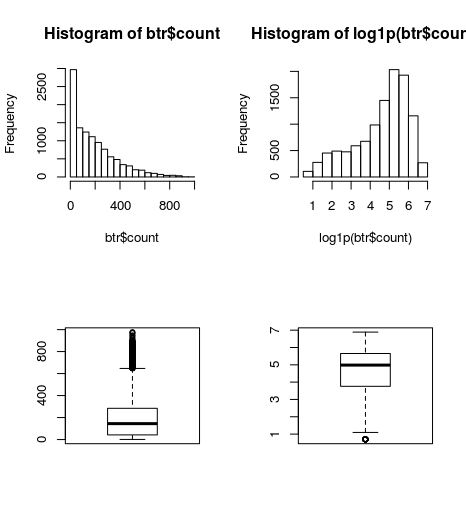

Bike Sharing Demand
===

<!-- @import "[TOC]" {cmd="toc" depthFrom=1 depthTo=6 orderedList=false} -->
<!-- code_chunk_output -->

* [Intro](#intro)
* [Start](#start)
	* [Score : 1.4 -> 0.66](#score-14-066)
	* [Score : 0.66 -> 0.60](#score-066-060)
	* [Score : 0.60 -> 0.42](#score-060-042)
	* [Score : 0.69 -> 0.60](#score-069-060)
	* [Score : 0.69 -> 0.60](#score-069-060-1)
	* [Score : 0.69 -> 0.60](#score-069-060-2)

<!-- /code_chunk_output -->


## Intro

Bike Sharing Demand의 Score 상승의 과정에 대한 기록

## Start

### Score : 1.4 -> 0.66

| Point  | RMSLE  |
|---|---|
| Basic  | 1.40  |
| Hour  | 0.69  |

datetime 변수에서 일, 시간 등의 성격을 변수화 시켜줘서 모델링하고 예측하였더니 점수 향상이 있었다.
``` r
bike <- btr %>% select(-casual, -registered, -count) %>%
  bind_rows(bte) %>%
  mutate(year = year(datetime),
         month = month(datetime),
         yday = yday(datetime),
         mday = mday(datetime),
         wday = wday(datetime),
         qday = qday(datetime),
         week = week(datetime),
         hour = hour(datetime),
         am = am(datetime) %>% as.integer(),
         pm = pm(datetime) %>% as.integer()) %>%
  select(-datetime)
```

### Score : 0.66 -> 0.60

| Point  | RMSLE  |
|---|---|
| Basic  | 1.40  |
| Hour  | 0.69  |
| XGB  | 0.60  |

기존 RadomForest 모델을 XGBoosting으로 바꾼 결과 점수 향상이 있었다.


### Score : 0.60 -> 0.42

| Point  | RMSLE  |
|---|---|
| XGB  | 0.60  |
| Log1P  | 0.42  |

예측 변수인 count를 단순 log 처리 했는데, 점수 변화가 크다.
``` r
par(mfrow=c(2,2))
hist(btr$count)
hist(log1p(btr$count))
boxplot(btr$count)
boxplot(log1p(btr$count))
```



### Score : 0.69 -> 0.60

| Point  | RMSLE  |
|---|---|
| Basic  | 1.40  |
| Hour  | 0.69  |
| XGB  | 0.60  |


### Score : 0.69 -> 0.60

| Point  | RMSLE  |
|---|---|
| Basic  | 1.40  |
| Hour  | 0.69  |
| XGB  | 0.60  |


### Score : 0.69 -> 0.60

| Point  | RMSLE  |
|---|---|
| Basic  | 1.40  |
| Hour  | 0.69  |
| XGB  | 0.60  |
