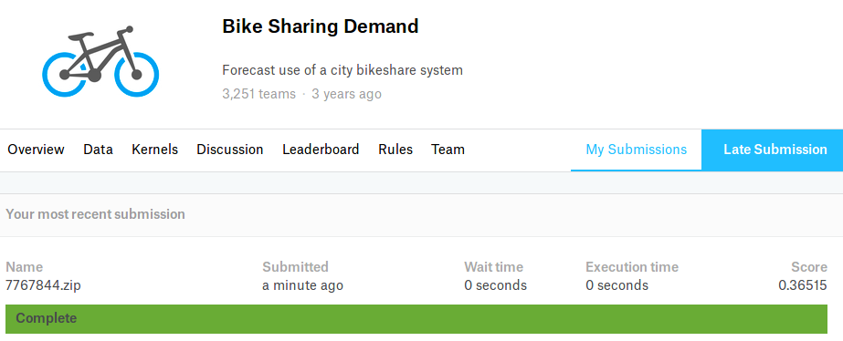
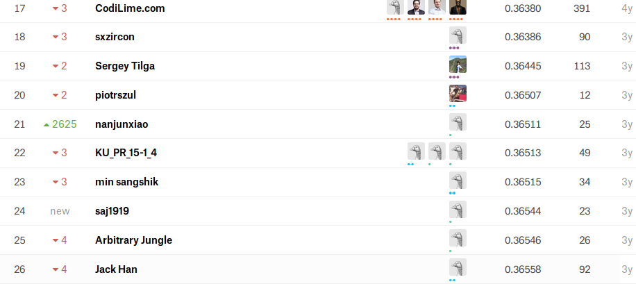

Kaggle UX Log
===

<!-- @import "[TOC]" {cmd="toc" depthFrom=1 depthTo=6 orderedList=false} -->
<!-- code_chunk_output -->

* [TrackML Particle Tracking Challenge](#trackml-particle-tracking-challenge)
* [Bike Sharing Demand](#bike-sharing-demand)
* [Avito Demand Prediction Challenge](#avito-demand-prediction-challenge)
* [TalkingData AdTracking Fraud Detection Challenge](#talkingdata-adtracking-fraud-detection-challenge)

<!-- /code_chunk_output -->

### TrackML Particle Tracking Challenge

High Energy Physics particle tracking in CERN detectors

[Note](TrackML/Note/Note.md)

### Bike Sharing Demand

[Note](/Bike/Note/Note.md)

---

### Avito Demand Prediction Challenge

[EDA](Avito/Avito_Code/EDA.html)     
[Note](Avito/Note/Note.md)

---
### TalkingData AdTracking Fraud Detection Challenge

Part1 : [Start ~ LB0.96](AdT/Note/Part1.md)

Part2 : [0.97진입 ~ Ending](AdT/Note/Part2.md)  

Part3 : [상위권 브리핑 분석 & 응용 계획](AdT/Note/Part3.md)  
