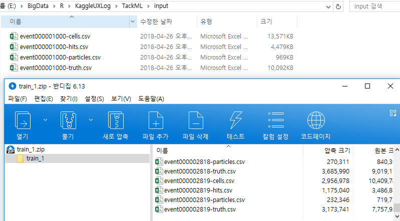
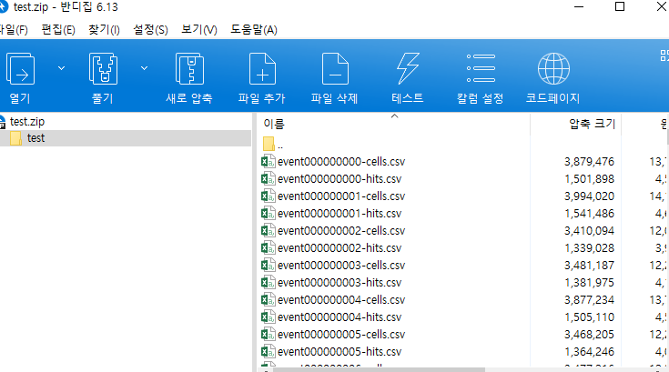
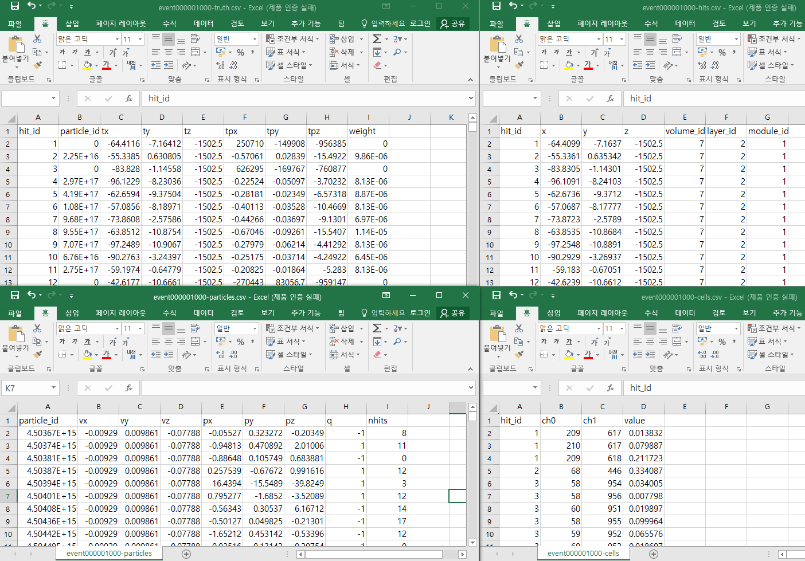

TrackML Particle Tracking Challenge
===

High Energy Physics particle tracking in CERN detectors
---

## Intro

CERN(유럽 입자 물리학 연구소)이다!

`HTML`과 `WWW`의 발상지인 CERN  

개인적으로 `WWW`이 혁신적이라고 느끼고 있고,   
그 혁신을 체감하고 즐기는 입장에서 물리학에 관한 데이터이지만  
할 수 있지 않을까라는 생각으로......

 
할 수 없는거였다!
그래도 왜 포기하는지, 포기는 하지만 어떤 경험을 했는지 적어 본다.

 

## Particle

단순 메모만 해 놓았던 내용이라, 인용글의 링크는 없다. 

> 입자물리학 실험에서 생성된 수많은 입자들의 경로를 재구성 (reconstruct) 하는 문제입니다. 3D 공간 상에 입자들이 지나가면서 남긴 점들이 있고, 이 점들을 연결해서 경로 (track) 을 구성하면 됩니다. 한 이벤트 당 입자 한두개와 점 수십개라면 단순한 regression problem 이겠지만, 입자의 갯수가 수백개 이상으로 늘어나면서 생기는 combinatorial explosion 을 머신러닝이나 그 외의 "고급" 알고리듬으로 처리하는 것이 관건입니다.

목적은 단순히(?) particle track를 만드면 된다고 한다. 
허나 Data를 살펴보니 단순한게 아니다. 

train 데이터가 zip 파일로 5개, 1개의 zip파일 용량이 15G이다. 

zip 파일을 보면 event별로 4개의 csv로 구성되어 있다.  
cells, hits, particles, truth  

test 데이터는  

event별로 2개의 csv(cells, hits)로 구성되어 있다. 

각각의 파일을 살펴보면 아래와 같다. 

아........  
아........   
아........   

이렇게만 봐도 막막한데   
조금 더 보니 제출해야 하는 track 정보가 
train에도 없다!  

할 수 없다는 게 더욱 더 명확해졌다.  

## What I learned

* DBSCAN
* rBayesianOptimization

